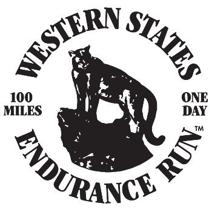

<p align="center">
  
</p>

---

# wser | open dataset

This project collects publicly available data for the [Western States Endurance Run](https://wser.org)
and formats it into [{json:api}](https://jsonapi.org) for ease of consumption.

## Goals

The goal for this project is to provide

- a normalized relational dataset
- cdn based access to that dataset
- a sqlite seed of the dataset
- typescript types for the data in the dataset
- request builders and schemas for the data for use with [warp-drive.io](https://warp-drive.io)

## Contributing

1. Install bun from [https://oven.sh](https://oven.sh)

2. Install dependencies:

```bash
bun install
```

To run the script which ingests and processes the data as necessary

```bash
bun run ./index.ts
```

This will scrape publicly available data from [https://wser.org](https://wser.org) and
store it in `.data-cache/raw/`. We keep this under git versioning and only scrape data
when we don't have an entry for it in the cache already: so unless looking to add data
to a new year or working to add ingestion of data from new sources and earlier years
this will likely do-nothing.
